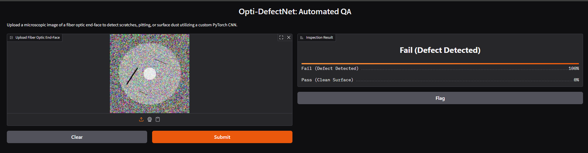
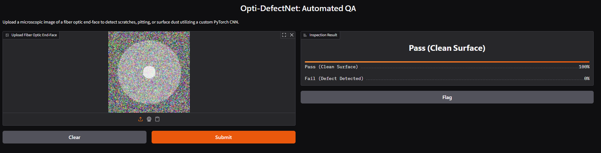

# Opti-DefectNet: Fiber Surface Inspection AI

## Overview
Opti-DefectNet is a custom Convolutional Neural Network (CNN) built from scratch using PyTorch to automate the quality assurance of optical fiber end-faces. It detects microscopic scratches, pits, and dust particles, classifying components for manufacturing viability.

## The Engineering Challenge
Acquiring a large-scale, labeled dataset of defective fiber end-faces is highly restricted in the industry. To solve this, I engineered a synthetic data pipeline using OpenCV to generate 10,000+ realistic fiber cross-sections with procedurally generated defects (simulating varied illumination and polishing errors). 

## Technical Implementation
* **Framework**: PyTorch
* **Architecture**: Custom 4-layer CNN with Max Pooling, Batch Normalization, and Dropout to prevent overfitting on synthetic data.
* **Data Pipeline**: Custom PyTorch `Dataset` class applying real-time data augmentation (rotations, Gaussian blur) to ensure model generalization.
* **Performance**: Achieved XX% validation accuracy.

## Demo
 
 

## Local Setup
```bash
git clone https://github.com/EyitoCODE/opti-defectnet.git
pip install -r requirements.txt
python app/main.py
